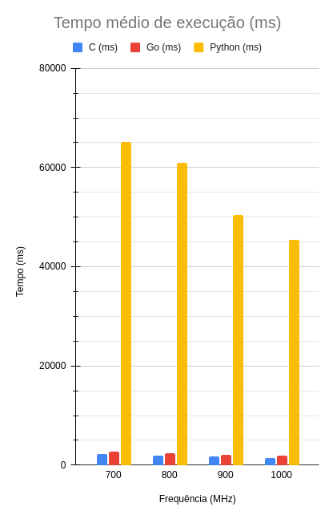

# Linux - Scaling Governor

Simple prime number algorithm to test CPU performance over different frequencies (700, 800, 900, 1000MHz).

Tested in C, Go and Python with Raspberry Pi Zero W (Bullseye, kernel v5.10).

Article:
https://www.embarcados.com.br/scaling-governor-gerenciando-o-clock-da-cpu-no-linux/

Data and graphs:
https://docs.google.com/spreadsheets/d/19uI_0dYbo585wacOL-3cySfDy9PmmFrMys9Ppr9pDgE/edit?usp=sharing

